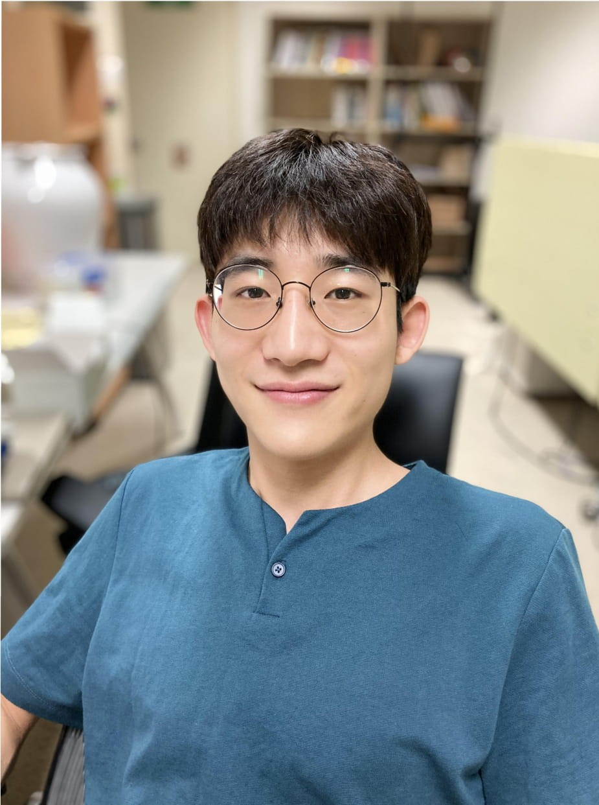

---
papersize: a4
documentclass: article
header-includes:
    - \usepackage{multicol}
    - \newcommand{\hideFromPandoc}[1]{#1}
    - \hideFromPandoc{
        \let\Begin\begin
        \let\End\end
      }

...

Jaewon Hur [{ width=20px }](jwhur19@gmail.com) [{ width=20px }](https://github.com/JaewonHur) [{ width=20px }](https://scholar.google.com/citations?user=8mqzrSsAAAAJ&hl=ko&oi=ao)
=================

## About Me 

\Begin{multicols}{2}

{ width=180px }

I am a Ph.D student at Seoul National University (SNU), advised by [Byoungyoung Lee](https://lifeasageek.github.io/) in [Compsed lab](https://compsec.snu.ac.kr). My primary research areas are hardware fuzzing and cloud computing. Especially, I have worked on implementing RTL fuzzer to find bugs in RISC-V CPU designs. Currently, I am working on secure cloud computing technology, so called confidential computing (e.g., Intel SGX, and AMD SEV). To be specific, I am working on re-designing current big-data, and machine learning platform to protect data while preserving efficiency.

\End{multicols}

## Research Interests

* Confidential Computing (e.g., Intel SGX, and AMD SEV)
* Secure cloud applications
* Fuzz Testing

## Education

* Ph.D., Electrical and Computer Engineering, Seoul National University, Mar. 2017 ~
  * Advisor: [Byoungyoung Lee](https://lifeasageek.github.io/)
  * Advisor before moving in to Compsec lab: [Sunghyun Choi](https://kr.linkedin.com/in/sunghyun-choi-b20268)

* B.S., Electrical Engineering, Pohang University of Science and Technology, Mar. 2013 ~ Feb. 2017.

## Projects

* **[2023.02 - ]** Designing a secure big-data analysis platform on confidential computing
  * Implemented the framework using [Intel SGX](https://github.com/intel/linux-sgx), and [Spark](https://github.com/apache/spark).

* **[2022.11 - ]** Automated stock trading application for the people who always lose their money
  * Published an Android App, [MumeParrot](https://play.google.com/store/apps/details?id=com.mumemume.mumeparrot).

* **[2022.11 - 2023.12]** Redesigning machine-learning platform to protect data
  * Implemented the framework using [AMD SEV](https://github.com/AMDESE/AMDSEV), [Pytorch](https://github.com/pytorch/pytorch), and [grpc](https://github.com/grpc).
    * Published a paper to SysTEX 2023 [[paper](https://jaewonhur.github.io/files/jwhur-graminer.pdf)][[slide](https://jaewonhur.github.io/files/jwhur-graminer-slides.pdf)].

* **[2021.05 - 2022.10]** Hardware fuzzing to find transient execution vulnerabilities in RISC-V CPUs
  * Implemented the fuzzer using [Verilator](https://github.com/verilator/verilator), [Chipyard](https://github.com/ucb-bar/chipyard), [Chisel](https://github.com/chipsalliance/chisel3), and [Firrtl](https://github.com/chipsalliance/firrtl).
  * Found 2 new transient execution vulnerabilities in [RISC-V Nutshell](https://github.com/OSCPU/NutShell), and [RISC-V Boom](https://github.com/riscv-boom/riscv-boom).
  * Published a paper to ACM CCS 2022 [[pdf](https://jaewonhur.github.io/files/jwhur-specdoctor.pdf)].

* **[2021.03 - 2022.02]** Firmware fuzzing to find bugs in Samsung secure elements
  * Implement the SoC emulator using [QEMU](https://github.com/qemu/qemu).
  
* **[2019.09 - 2021.05]** Hardware fuzzing to find functional bugs in RISC-V CPUs
  * Implemented the fuzzer using [Verilator](https://github.com/verilator/verilator), [Spike](https://github.com/riscv-software-src/riscv-isa-sim), [Firrtl](https://github.com/chipsalliance/firrtl), and [Cocotb](https://github.com/cocotb/cocotb).
  * Found 16 new bugs, including 6 CVEs in RISC-V CPUs.
  * Published a paper to IEEE S&P 2021 [[pdf](https://jaeownhur.github.io/files/jwhur-difuzzrtl.pdf)].

## Publications

* **[SysTEX 2023]** Graminer: Fuzz Testing Gramine LibOS to Harden the Trusted Computing Base [[pdf](https://jaewonhur.github.io/files/jwhur-graminer.pdf)]\
    **Jaewon Hur**, and Byoungyoung Lee

* **[ACM CCS 2022]** SpecDoctor: Differential Fuzz Testing to Find Transient Execution Vulnerabilities [[pdf](https://jaewonhur.github.io/files/jwhur-specdoctor.pdf)]\
    **Jaewon Hur**, Suhwan Song, Sunwoo Kim, and Byoungyoung Lee
    
* **[Usenix Security 2022]** FuzzOrigin: Detecting UXSS Vulnerabilities in Browsers through Origin Fuzzing [[pdf](https://jaeonhur.github.io/files/swkim-fuzzorigin.pdf)]\
    Sunwoo Kim, Youngmin Kim, **Jaewon Hur**, Suhwan Song, Gwangmu Lee, and Byoungyoung Lee
    
* **[IEEE/ACM ICSE 2022]** R2Z2: Detecting Rendering Regressions in Web Browsers through Differential Fuzz Testing [[pdf](https://jaeonhur.github.io/files/shsong-r2z2.pdf)]\
    Suhwan Song, **Jaewon Hur**, Sunwoo Kim, Philip Rogers, and Byoungyoung Lee
    
* **[IEEE S&P 2021]** DifuzzRTL: Differential Fuzz Testing to Find CPU Bugs [[pdf](https://jaewonhur.github.io/files/jwhur-difuzzrtl.pdf)]\
    **Jaewon Hur**, Suhwan Song, Dongup Kwon, Eunjin Baek, Jangwoo Kim, and Byoungyoung Lee
    
* **[IEEE WCNC 2021]** Push yoUr Password: Secure and Fast WiFi Connection for IoT Devices [[pdf](https://jaewonhur.github.io/files/jychoi-pup.pdf)]\
    Junyoung Choi, **Jaewon Hur**, and Saewoong Bahk
    
* **[IEEE MASS 2019]** EV-CAST: Interference and Energy-Aware Video Multicast Exploiting Collaborative Relays [[pdf](https://jaewonhur.github.io/files/ycshin-evcast.pdf)]\
    Yeonchul Shin, **Jaewon Hur**, Gyujin Lee, Jonghoe Koo, Junyoung Choi, Sung-Ju Lee, and Sunghyun Choi
